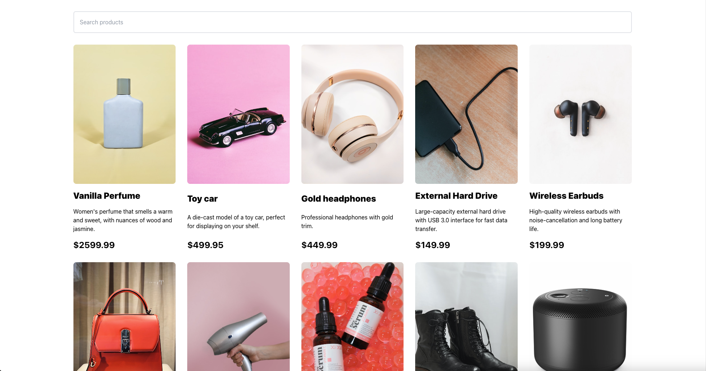

# ecomDev



This project was a project for my Frontend Frameworks Course Assignment as Noroff. 

## Description

This project is a prototype of a e-commerce store, in the sense that is has functionality, but not functionality to actually buy products. 

The frontpage contains a big hero section, a search bar that filters the products directly when you start to write and a grid of product cards. The images from the noroff api is appealing, and it helps the product cards really pop off. 

On the product page it lists a big image, the description and prices. If there is a rebate it also calculates the exact percentage of rebate and shows that in a separate box. You can also click to add to cart. 

If you add to cart, it adds the product to localStorage and opens up a box that lets you go to the cart. The cart page renders the products from cart and gives you the opportunity to remove it aswell. It sums up the prices and gives you the total price. If you check out, it sends you to a thank you page as there is no actual functionality in place to buy things, but you can easily integrate with your favorite provider.


## Built With

This project was built on react.js and tailwind CSS. It also use Noroff API v2

- [React.js](https://reactjs.org/)
- [TailwindCSS](https://tailwindcss.com)
- [NoroffAPI](https://docs.noroff.dev/docs/v2)

## Getting Started

### Installing

1. Clone the repo:

```bash
git clone git@github.com:bettytro/frontend-frameworks-ca-noroff.git
```

2. Install the dependencies:

```
npm install
```

### Running

To open a development server, run the following command:

```bash
npm run start
```

To build a stable build before deploying: 

```bash
npm run build
```


## Contributing

If you want to contribute, you are more than welcome. Add a PR, and I will look into it and merge if I find it interesting. I appreciate you contributing to my project, and will be forever thankful.

## Contact

You can contact me at elisabeth@darkwoodmedia.no

